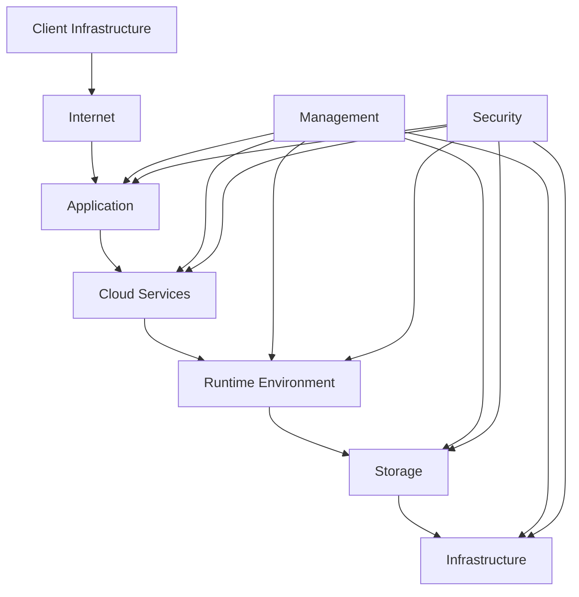
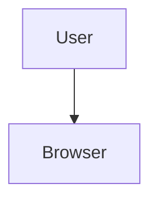
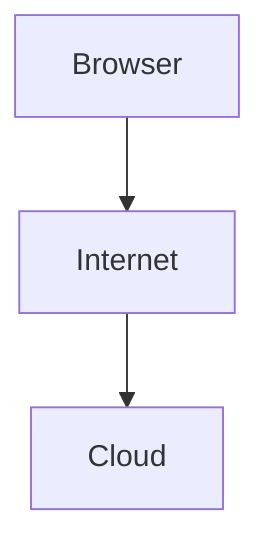
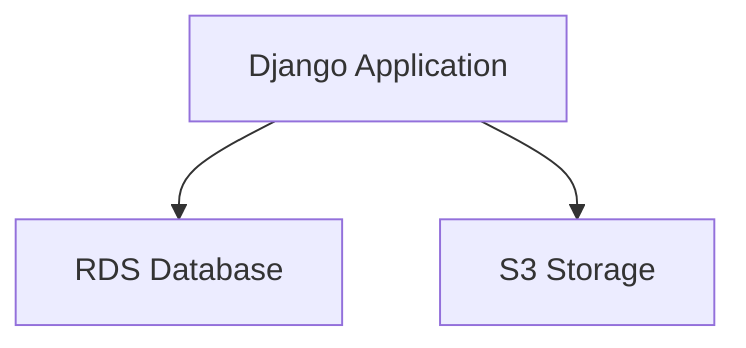
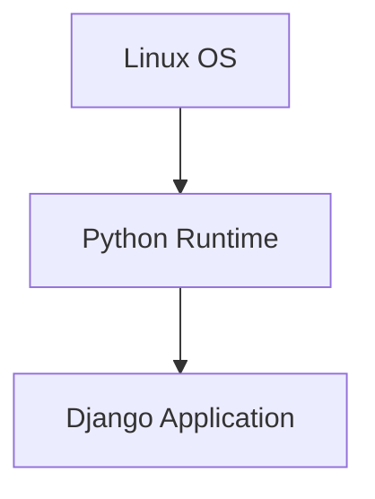
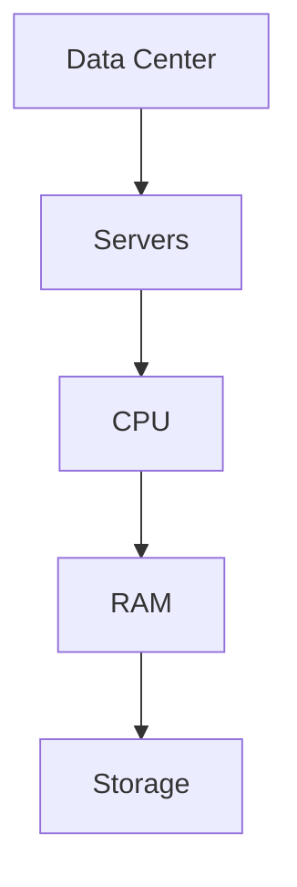
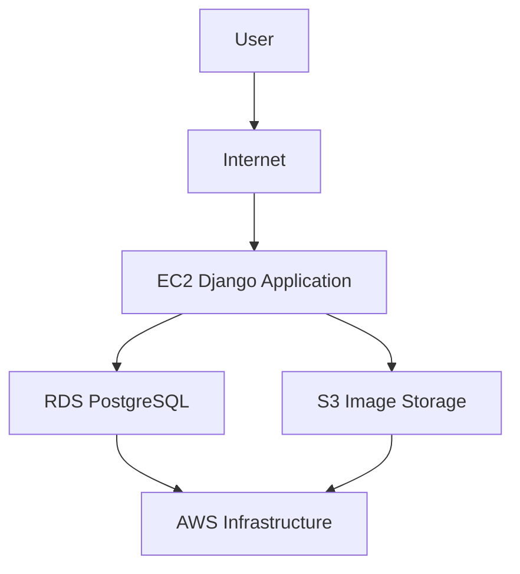

# Cloud Computing

## What is Cloud Computing?

Cloud Computing is the delivery of computing resources such as servers, storage, databases, networking, and software over the internet on demand with pay-as-you-go pricing.

Instead of purchasing and managing physical hardware, organizations can access cloud resources whenever needed and scale them based on demand.

---

## Benefits of Cloud Computing

- Scalability
- High Availability
- Pay-as-you-go Pricing
- Global Reach
- Reduced Infrastructure Management
- Faster Deployment
- Better Reliability

---

## Cloud Architecture

---

## Architecture Breakdown

### 1. Client Infrastructure

The user-side devices used to access cloud applications.

Examples:

- Chrome Browser
- Firefox Browser
- Mobile App
- Laptop
- Desktop
- Smartphone

The client sends requests to cloud-hosted applications through the internet.

---

### 2. Internet

The communication bridge between users and cloud services.

The internet allows users to access cloud resources from anywhere in the world.

---

### 3. Application

The software used by end users.

Examples:

- Django Application
- FastAPI Application
- React Application
- Java Application
- Spring Boot Application
- Node.js Application

The application processes user requests and communicates with cloud services.

---

### 4. Cloud Services

Cloud providers offer managed services that applications use.

AWS Examples:

- EC2 (Compute)
- S3 (Object Storage)
- RDS (Database)
- Lambda (Serverless)
- CloudFront (CDN)

These services reduce operational overhead and improve scalability.

---

### 5. Runtime Environment

The environment where application code executes.

Examples:

- Python Runtime
- Java Runtime
- Node.js Runtime
- Docker Runtime

The runtime environment provides the necessary software and dependencies for application execution.

---

### 6. Storage

Storage services keep application data safe and available.

Examples:

- Amazon S3
- Amazon EBS
- Amazon RDS
- Amazon DynamoDB

Stores:

- Images
- Videos
- User Data
- Application Logs
- Documents
- Backups

Storage services ensure durability and availability of data.

---

### 7. Infrastructure

The foundation of cloud computing.

Includes:

- Physical Servers
- CPU
- RAM
- SSD Storage
- Networking Equipment
- Data Centers
- Virtualization Technology

Cloud providers own and manage this hardware infrastructure.

---

### 8. Management

Management tools help monitor and control cloud resources.

AWS Examples:

- AWS Management Console
- CloudWatch
- CloudFormation
- AWS Systems Manager

Responsibilities:

- Resource Monitoring
- Logging
- Deployment Automation
- Infrastructure Management
- Performance Tracking

Management tools simplify cloud operations.

---

### 9. Security

Security protects cloud resources and data.

AWS Examples:

- IAM (Identity and Access Management)
- Security Groups
- AWS KMS
- AWS Shield

Controls:

- User Authentication
- Access Permissions
- Network Security
- Encryption
- Threat Protection

Security is applied across every layer of the cloud architecture.

---

## Real-World AWS Example

Consider a Django e-commerce application.

Architecture:

### Flow

1. User opens the website.
2. Request travels through the internet.
3. EC2 receives the request.
4. Django application processes the request.
5. Data is stored or retrieved from RDS.
6. Images are stored in S3.
7. AWS infrastructure powers all services.
8. Security protects resources.
9. Management tools monitor and control the environment.

---

## Key Points

- Cloud computing provides resources over the internet.
- Applications run inside a runtime environment.
- Cloud services provide compute, storage, and databases.
- Infrastructure consists of physical hardware managed by the cloud provider.
- Security protects all cloud resources.
- Management tools help monitor and control cloud environments.
- AWS offers services such as EC2, S3, RDS, and Lambda to build scalable applications.

---

## Interview Question

### Where does EC2 belong?

EC2 belongs to the **Cloud Services Layer** because it is a compute service provided by AWS.

Underneath EC2, AWS manages the **Infrastructure Layer**, which includes:

- Physical Servers
- CPU
- RAM
- Storage
- Networking
- Data Centers

As a user, you interact with EC2 while AWS manages the underlying hardware.

---

## Summary

Cloud Computing enables organizations to access computing resources over the internet without managing physical hardware. Cloud providers handle the infrastructure while users focus on building and deploying applications using scalable and reliable cloud services.