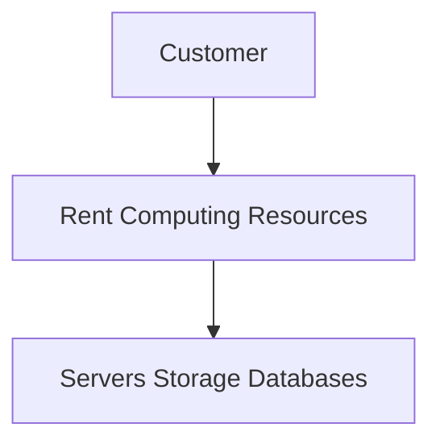

# Cloud Providers

A cloud provider is a company that owns and manages large data centers containing servers, storage systems, and networking equipment.

These providers offer computing resources over the internet, allowing customers to rent resources instead of purchasing and maintaining their own hardware.

Instead of buying servers:

---

## The Big Three Cloud Providers

### 1. AWS (Amazon Web Services)

- Created by Amazon
- Largest cloud provider in the world
- Offers hundreds of cloud services

Popular Services:

- EC2 (Virtual Servers)
- S3 (Object Storage)
- RDS (Managed Database)
- Lambda (Serverless Computing)

AWS is known for:

- Large service portfolio
- Global infrastructure
- Mature ecosystem

---

### 2. Microsoft Azure

- Created by Microsoft
- Second largest cloud provider

Strong adoption among organizations using:

- Windows Server
- Active Directory
- Microsoft 365
- .NET Applications

Popular Services:

- Azure Virtual Machines
- Azure Blob Storage
- Azure SQL Database
- Azure Functions

Azure is known for:

- Enterprise integration
- Hybrid cloud solutions
- Microsoft ecosystem support

---

### 3. Google Cloud Platform (GCP)

- Created by Google
- Known for performance and innovation

Popular Services:

- Compute Engine
- Cloud Storage
- Cloud SQL
- BigQuery

GCP is popular for:

- Data Analytics
- Artificial Intelligence (AI)
- Machine Learning (ML)
- Kubernetes and Containers

---

## Comparison

| Provider | Strength |
|-----------|-----------|
| AWS | Largest ecosystem and service portfolio |
| Azure | Strong Microsoft integration |
| GCP | AI, ML, Data Analytics, Kubernetes |

---

## Key Points

- Cloud providers own and manage data centers.
- Customers rent computing resources instead of buying hardware.
- AWS, Azure, and GCP are the three largest cloud providers.
- Each provider offers compute, storage, database, networking, and security services.
- Cloud providers allow businesses to scale quickly while reducing infrastructure costs.