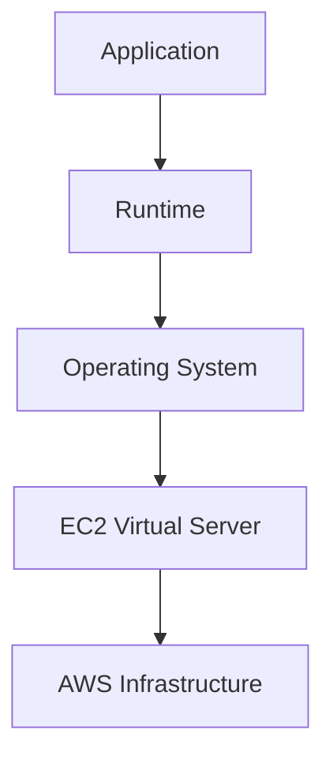
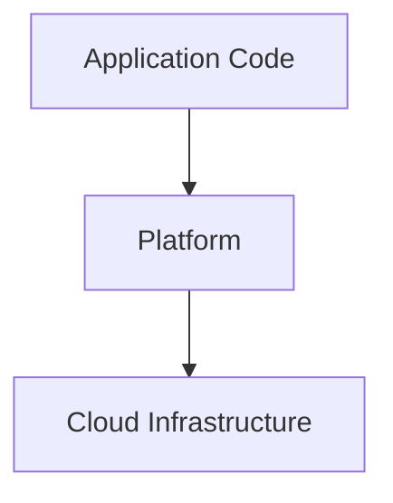
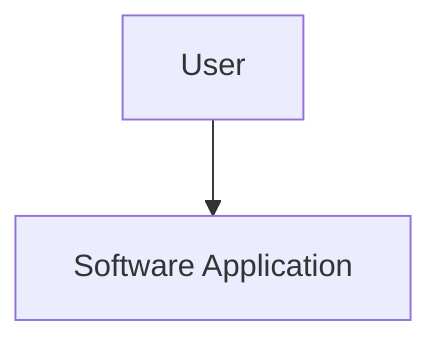
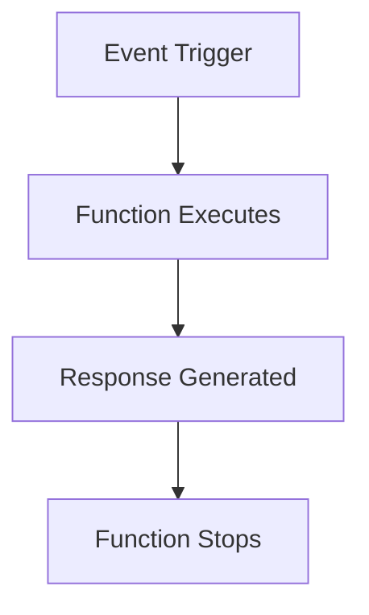

# Types of Cloud Computing Services

Cloud service models define how much responsibility is managed by the cloud provider and how much is managed by the customer.

The four common service models are:

1. IaaS (Infrastructure as a Service)
2. PaaS (Platform as a Service)
3. SaaS (Software as a Service)
4. FaaS (Function as a Service)

---

## 1. IaaS (Infrastructure as a Service)

IaaS provides virtualized computing resources such as servers, storage, and networking over the internet.

### You Manage

- Applications
- Runtime (Python, Java, Node.js, etc.)
- Operating System
- Data

### Cloud Provider Manages

- Physical Servers
- Storage Hardware
- Networking
- Virtualization
- Data Centers

### AWS Example

- Amazon EC2 (Elastic Compute Cloud)

### Use Case

When you need full control over the operating system and application environment.

---

## 2. PaaS (Platform as a Service)

PaaS provides a complete platform for developing, deploying, and managing applications without managing servers or operating systems.

### You Manage

- Application Code
- Application Data

### Cloud Provider Manages

- Runtime
- Operating System
- Servers
- Storage
- Networking
- Infrastructure

### Examples

- AWS Elastic Beanstalk
- Heroku
- Google App Engine

### Use Case

When developers want to focus on writing code rather than managing infrastructure.

---

## 3. SaaS (Software as a Service)

SaaS delivers ready-to-use software applications over the internet.

Users simply access and use the software through a browser or application.

### You Manage

- Software Usage
- User Settings

### Cloud Provider Manages

- Application
- Runtime
- Operating System
- Servers
- Storage
- Networking
- Infrastructure

### Examples

- Gmail
- ChatGPT
- Zoom
- Notion
- Google Docs

### Use Case

When users need software without installing or maintaining it.

---

## 4. FaaS (Function as a Service)

FaaS allows developers to run individual functions in response to events without managing servers.

Functions execute only when triggered and stop when execution is complete.

### You Manage

- Function Code

### Cloud Provider Manages

- Runtime
- Servers
- Scaling
- Networking
- Infrastructure

### Examples

- AWS Lambda
- Google Cloud Functions
- Azure Functions

### Use Case

When applications need event-driven or serverless processing.

---

## Comparison

| Service Model | You Manage | Cloud Provider Manages |
|---------------|------------|------------------------|
| IaaS | Application, Runtime, OS, Data | Infrastructure |
| PaaS | Application Code, Data | Runtime, OS, Infrastructure |
| SaaS | Software Usage | Everything Else |
| FaaS | Function Code | Runtime, Scaling, Infrastructure |

---

## Summary

- **IaaS** provides virtual infrastructure.
- **PaaS** provides a development platform.
- **SaaS** provides ready-to-use software.
- **FaaS** provides event-driven serverless functions.
- As we move from **IaaS → PaaS → SaaS**, the cloud provider manages more responsibilities.