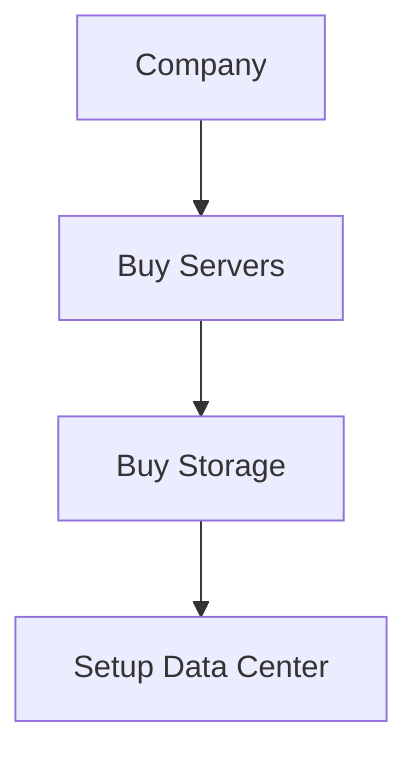
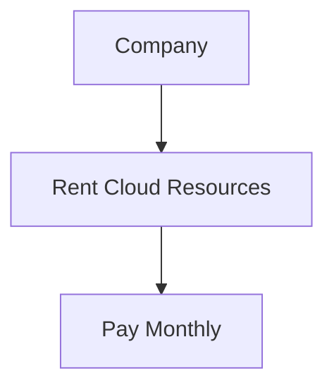
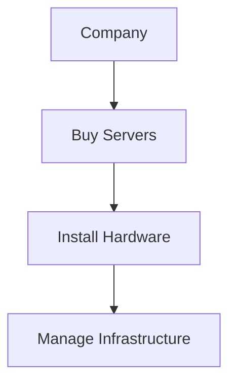
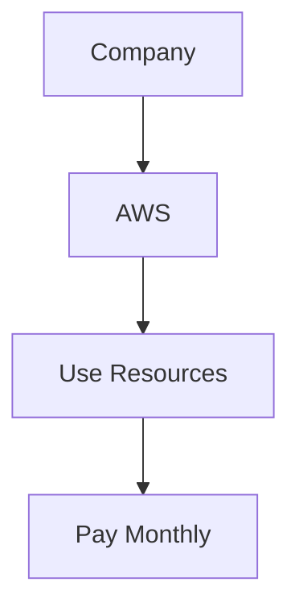

# CapEx and OpEx

## What is CapEx?

**CapEx (Capital Expenditure)** is money spent on purchasing, upgrading, or maintaining physical assets that provide long-term value.

In traditional IT infrastructure, companies buy and own their hardware.

Examples:

- Purchasing Servers
- Buying Storage Devices
- Purchasing Network Equipment
- Building Data Centers
- Upgrading Hardware

### Traditional Infrastructure Example



### Characteristics of CapEx

- Large upfront investment
- Company owns the infrastructure
- Maintenance responsibility belongs to the company
- Hardware may become outdated over time
- Requires long-term planning

### Example

A company purchases:

- 10 Servers
- Network Switches
- Storage Systems

Total Cost:

```text
₹20,00,000 upfront
```

The company owns and manages everything.

---

## What is OpEx?

**OpEx (Operational Expenditure)** is money spent on day-to-day operations and services.

In cloud computing, companies rent resources and pay only for what they use.

Examples:

- Cloud Servers
- Cloud Storage
- Managed Databases
- SaaS Subscriptions
- Internet Services

### Cloud Computing Example



### Characteristics of OpEx

- No large upfront investment
- Pay-as-you-go pricing
- Easy to scale up or down
- Maintenance handled by the cloud provider
- Lower financial risk

### Example

Instead of buying servers:

```text
EC2 Instance = ₹5,000/month
RDS Database = ₹3,000/month
S3 Storage = Based on usage
```

The company pays only for consumed resources.

---

## CapEx vs OpEx

| Feature | CapEx | OpEx |
|----------|--------|--------|
| Full Form | Capital Expenditure | Operational Expenditure |
| Payment | Large upfront cost | Pay-as-you-go |
| Ownership | Company owns assets | Cloud provider owns assets |
| Maintenance | Company manages | Provider manages |
| Scalability | Difficult | Easy |
| Risk | Higher | Lower |
| Initial Cost | High | Low |

---

## Real-World Example

### Traditional Data Center (CapEx)



Costs:

- Hardware Purchase
- Electricity
- Cooling
- Maintenance
- IT Staff

---

### Cloud Computing (OpEx)



Costs:

- EC2 Usage
- S3 Storage
- RDS Database
- Network Usage

No hardware purchase required.

---

## Why Cloud Computing Favors OpEx

Cloud providers such as AWS, Azure, and GCP allow organizations to:

- Avoid purchasing expensive hardware
- Scale resources instantly
- Pay only for actual usage
- Reduce maintenance overhead
- Launch applications faster

This makes cloud computing primarily an **OpEx model**.

---

## Interview Question

### Why is AWS considered OpEx?

AWS is considered OpEx because customers do not purchase physical infrastructure.

Instead, they:

- Rent computing resources
- Pay based on usage
- Avoid large upfront hardware investments

AWS owns and manages the underlying infrastructure.

---

## Quick Memory Trick

### CapEx

**Buy and Own**

```text
CapEx = Purchasing Assets
```

### OpEx

**Rent and Use**

```text
OpEx = Paying for Services
```

---

## Summary

- **CapEx** involves purchasing and owning infrastructure.
- **OpEx** involves paying for services as they are used.
- Traditional data centers follow a CapEx model.
- Cloud computing primarily follows an OpEx model.
- AWS, Azure, and GCP help organizations reduce CapEx by shifting to OpEx.