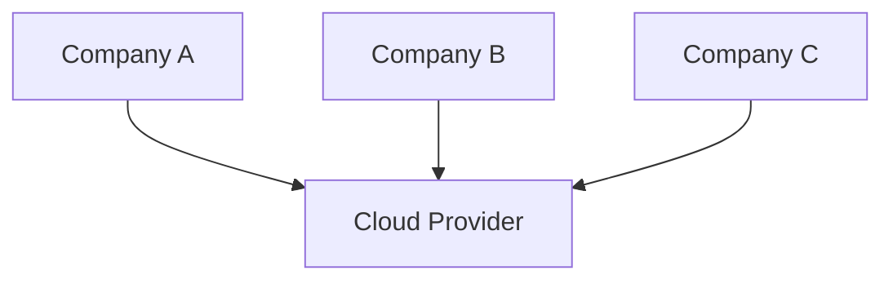
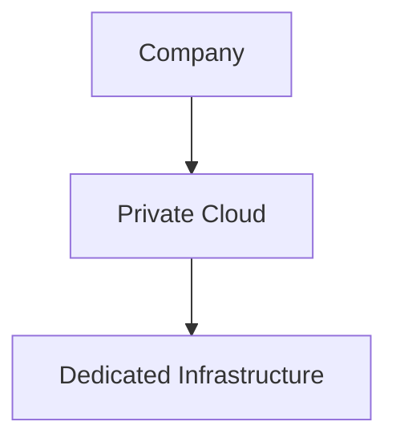
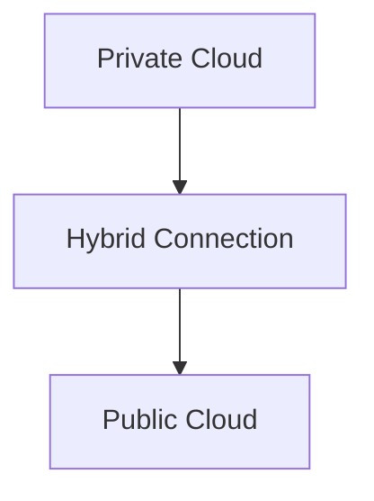

# Cloud Deployment Models

Cloud deployment models describe where cloud infrastructure is deployed and who can access it.

There are three main deployment models:

1. Public Cloud
2. Private Cloud
3. Hybrid Cloud

---

## 1. Public Cloud

A public cloud is owned and managed by a cloud provider and shared among multiple customers.

Examples:

- AWS (Amazon Web Services)
- Microsoft Azure
- Google Cloud Platform (GCP)

Multiple organizations use the same cloud provider's infrastructure while their data remains isolated and secure.

### Characteristics

- Lower cost
- Highly scalable
- No hardware management
- Fast deployment
- Pay-as-you-go pricing

---

## 2. Private Cloud

A private cloud is dedicated to a single organization.

The infrastructure is used exclusively by one company and can be hosted on-premises or by a third-party provider.

### Example

A bank running its own cloud infrastructure inside its data center.

### Characteristics

- Greater control
- Higher security
- Custom configurations
- Higher cost
- Organization manages infrastructure

---

## 3. Hybrid Cloud

A hybrid cloud combines public cloud and private cloud environments.

Some workloads remain in private infrastructure while others run in the public cloud.

### Example

A company stores sensitive customer data in a private cloud while hosting its public website on AWS.

### Characteristics

- Flexibility
- Better scalability
- Sensitive data remains private
- Can use public cloud resources when needed
- Supports gradual cloud adoption

---

## Comparison

| Deployment Model | Infrastructure Access | Cost | Control | Scalability |
|------------------|----------------------|------|----------|-------------|
| Public Cloud | Shared | Low | Moderate | High |
| Private Cloud | Single Organization | High | High | Moderate |
| Hybrid Cloud | Mixed | Medium | High | High |

---

## Quick Memory Trick

### Public Cloud

Shared infrastructure for many customers.

### Private Cloud

Dedicated infrastructure for one organization.

### Hybrid Cloud

Combination of public and private cloud environments.

---

## Summary

- Public Cloud is shared and managed by a cloud provider.
- Private Cloud is dedicated to a single organization.
- Hybrid Cloud combines both public and private cloud environments.
- Organizations choose a deployment model based on cost, security, control, and scalability requirements.