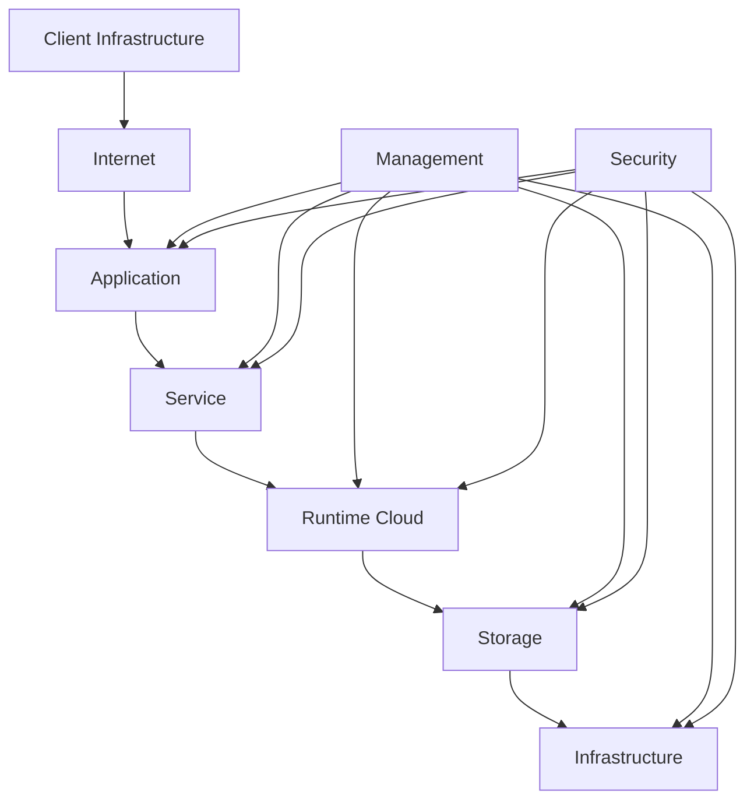

# Cloud Computing

## What is Cloud Computing?

Cloud computing has transformed how organizations build, deploy and scale technology. Instead of owning physical infrastructure, users access computing resources over the internet on demand.

## Benefits

- Scalability
- High Availability
- Pay-as-you-go Pricing
- Global Reach
- Reduced Infrastructure Management

## Cloud Architecture Diagram

