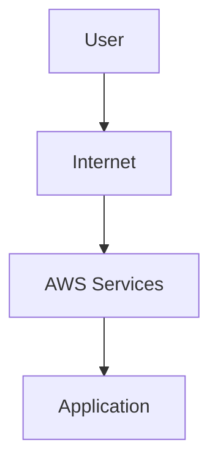
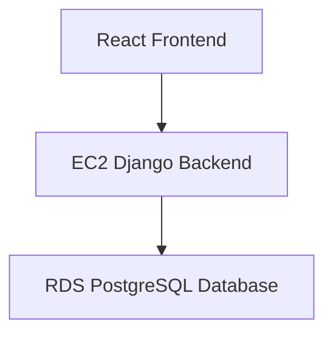

# AWS (Amazon Web Services)

AWS (Amazon Web Services) is a cloud computing platform provided by Amazon.

It allows individuals and organizations to rent computing resources over the internet using a pay-as-you-go pricing model.

Resources include:

- Servers
- Storage
- Databases
- Networking
- Security Services
- AI/ML Services

---

## AWS Services

### Compute

- EC2
- Lambda

### Storage

- S3
- EBS

### Databases

- RDS
- DynamoDB

### Networking

- VPC
- Route 53

### Security

- IAM
- Security Groups

---

## Benefits of AWS

- Pay-as-you-go Pricing
- Highly Scalable
- Global Infrastructure
- High Availability
- Strong Security
- No Hardware Maintenance

---

## Common Use Cases

- Hosting Websites
- Running Web Applications
- File Storage
- Database Hosting
- API Hosting
- Machine Learning
- Data Analytics

---

## Real-World Example

A user accesses the frontend, which communicates with a backend application running on EC2. Application data is stored in an RDS database.