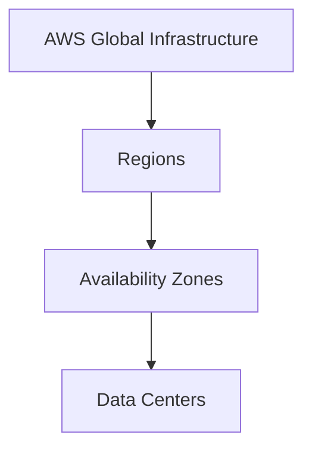
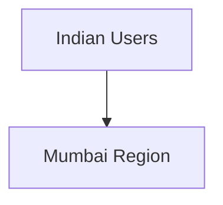
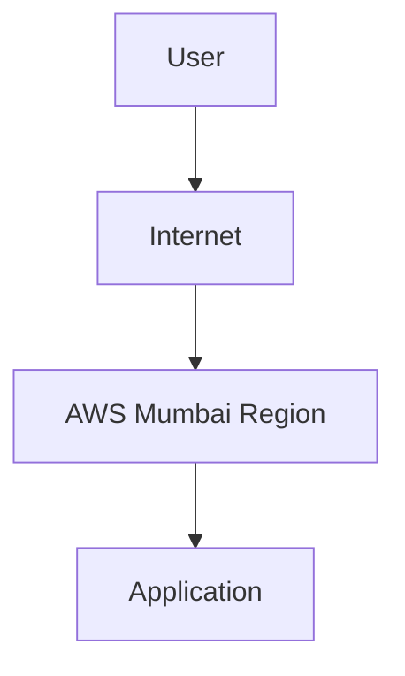
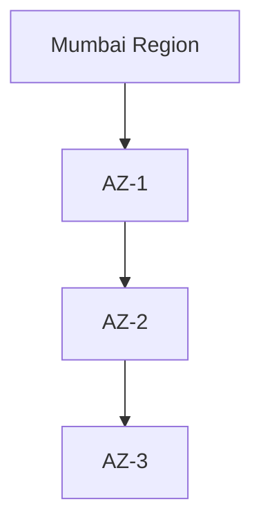
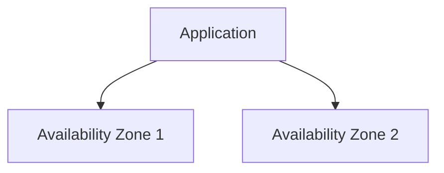
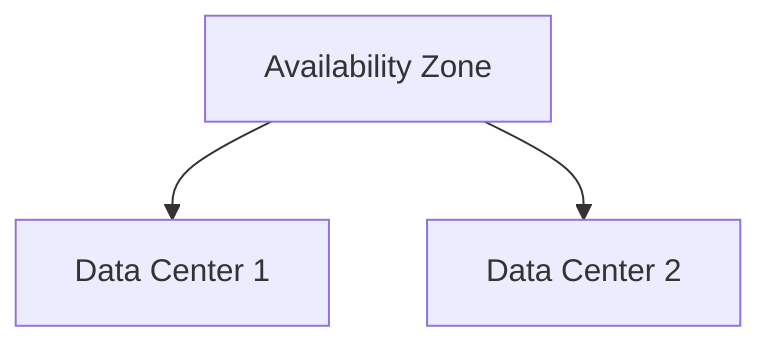
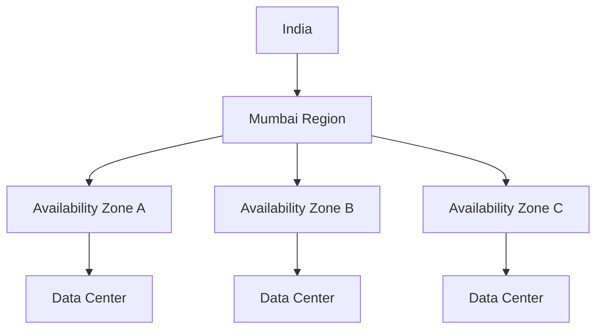
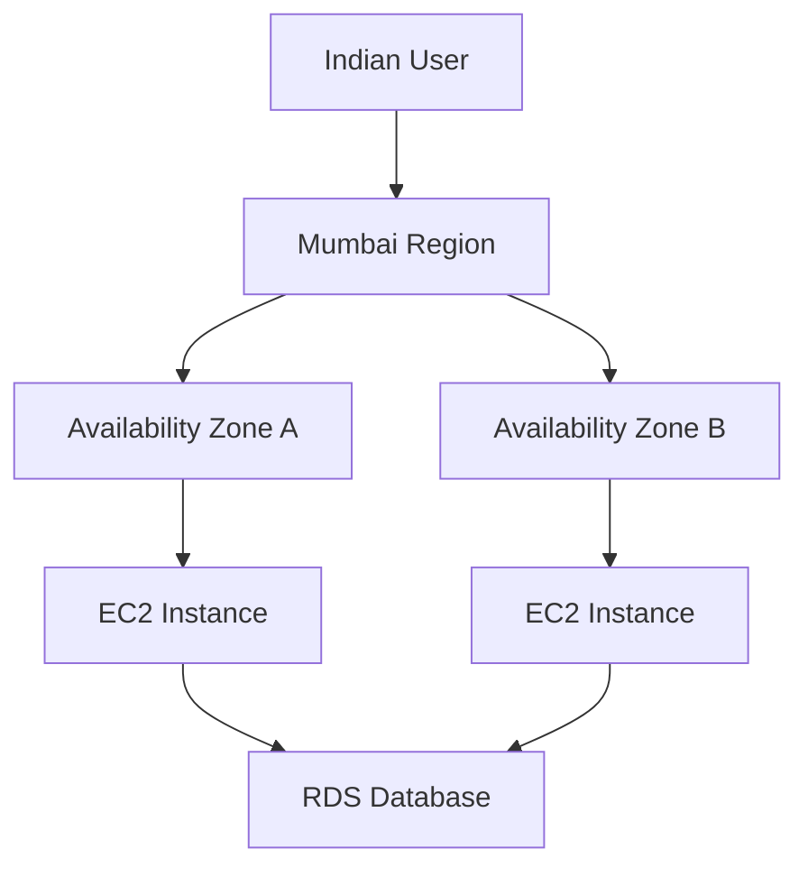
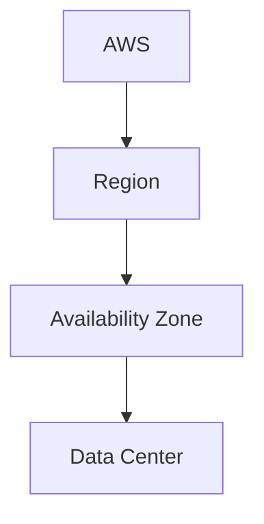

# AWS Global Infrastructure (Regions, Availability Zones & Data Centers)

## AWS Global Infrastructure

AWS provides cloud services through a worldwide network of Regions, Availability Zones (AZs), and Data Centers.

This infrastructure helps AWS deliver:

- High Availability
- Fault Tolerance
- Scalability
- Low Latency

### Basic Structure



---

## 1. Regions

A Region is a physical geographic area where AWS operates cloud infrastructure.

Each Region contains multiple Availability Zones.

### Examples of AWS Regions

| Region | Code |
|----------|----------|
| US East (N. Virginia) | us-east-1 |
| US East (Ohio) | us-east-2 |
| US West (Oregon) | us-west-2 |
| Asia Pacific (Mumbai) | ap-south-1 |
| Asia Pacific (Singapore) | ap-southeast-1 |
| Europe (Ireland) | eu-west-1 |

### Why Regions Exist

#### Low Latency

Deploy applications closer to users.



This results in faster response times.

### Example



---

## 2. Availability Zones (AZs)

An Availability Zone (AZ) is one or more isolated Data Centers within a Region.

Each Availability Zone has:

- Independent Power
- Independent Cooling
- Independent Networking

### Example

Mumbai Region:



### Why Availability Zones Exist

- High Availability
- Fault Tolerance
- Disaster Recovery
- Better Reliability

### Multi-AZ Architecture



If one Availability Zone fails, the application can continue running in another Availability Zone.

---

## 3. Data Centers

Data Centers are the physical facilities that contain AWS hardware.

They include:

- Servers
- Storage Systems
- Networking Equipment
- Power Systems
- Cooling Systems

### Structure



AWS customers generally interact with Regions and Availability Zones rather than individual Data Centers.

---

## AWS Infrastructure in India

AWS currently operates the Mumbai Region.

### Mumbai Region

| Region Name | Code |
|-------------|------|
| Asia Pacific (Mumbai) | ap-south-1 |

The Mumbai Region contains multiple Availability Zones.

### India Infrastructure Example



---

## Example Deployment



Benefits:

- Low Latency
- High Availability
- Better Reliability
- Fault Tolerance

---

## Quick Summary

| Component | Description |
|------------|------------|
| Region | Geographic area where AWS operates |
| Availability Zone | Isolated location within a Region |
| Data Center | Physical facility containing AWS hardware |

### Hierarchy



### Memory Trick

```text
AWS
 └─ Region
      └─ Availability Zone
             └─ Data Center
```

Think of it as:

```text
Country → City → Building
```

- Region = City
- Availability Zone = Campus
- Data Center = Building