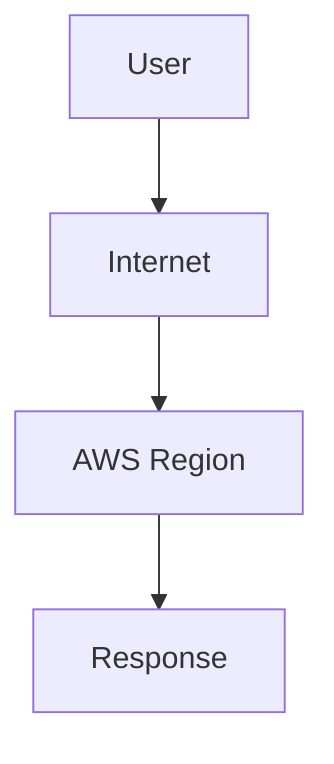
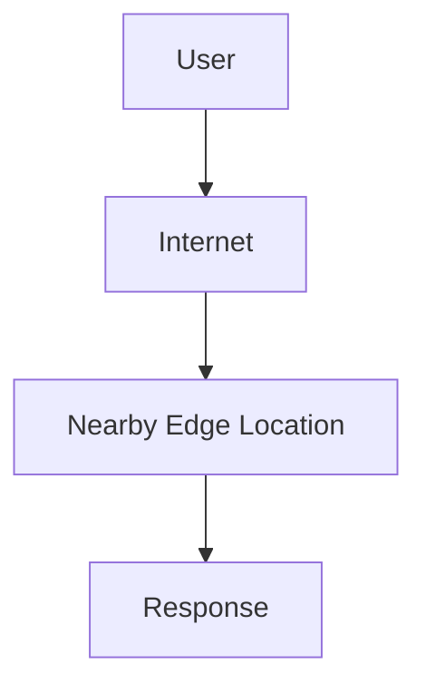
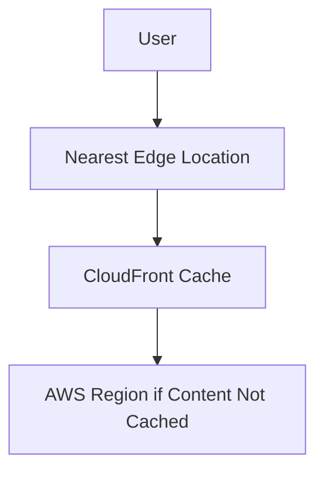
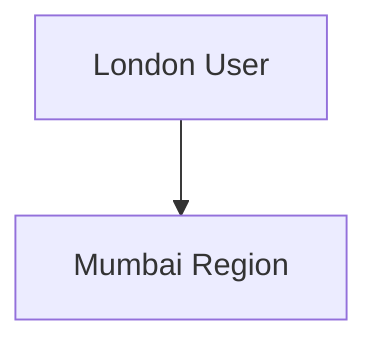
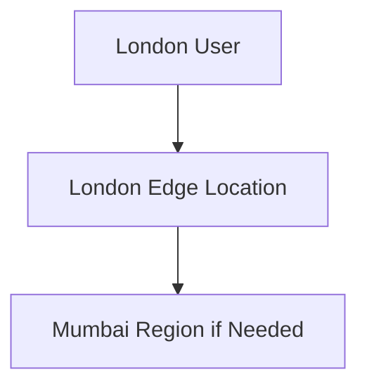

# AWS Edge Locations

## What are Edge Locations?

An Edge Location is a physical AWS location used to deliver content and services closer to users.

The primary goal of Edge Locations is to:

- Reduce Latency
- Improve Performance
- Deliver Content Faster
- Enhance User Experience

Unlike Regions, Edge Locations are distributed worldwide and are located closer to end users.

---

## Why Edge Locations Exist

Without Edge Locations, every request must travel to an AWS Region.

### Without Edge Locations



### Problems

- Longer network distance
- Higher latency
- Slower content delivery

---

## With Edge Locations

Frequently accessed content is stored closer to users.



### Benefits

- Lower Latency
- Faster Content Delivery
- Better User Experience
- Reduced Load on AWS Regions

---

## Physical Infrastructure

Edge Locations are physical AWS facilities that contain:

- Servers
- Storage
- Networking Equipment

Common cached content includes:

- Images
- Videos
- CSS Files
- JavaScript Files
- Static Website Content
- Downloads

---

## AWS CloudFront

The primary AWS service that uses Edge Locations is **CloudFront**.

### What is CloudFront?

CloudFront is AWS's Content Delivery Network (CDN).

It distributes content through Edge Locations worldwide.

### How CloudFront Works



If the content already exists in the Edge Location cache, it is served immediately.

If not, CloudFront retrieves it from the AWS Region and stores it for future requests.

---

## Real-World Example

### Application Location

Mumbai Region (ap-south-1)

### User Location

London

### Without CloudFront



Every request travels to India.

### With CloudFront



Frequently accessed content is delivered from London instead of Mumbai.

### Result

- Faster Loading
- Lower Latency
- Better Performance

---

## Region vs Edge Location

| Region | Edge Location |
|----------|----------|
| Runs Applications | Delivers Content |
| Hosts EC2, RDS, Lambda | Hosts Cached Content |
| Large AWS Infrastructure | Smaller AWS Infrastructure |
| Contains Multiple AZs | Distributed Near Users |
| Stores Primary Application Data | Stores Temporary Cached Data |

---

## Quick Memory Trick

### Region

Where your application runs.

```text
EC2
RDS
Lambda
S3
```

### Edge Location

Where content is cached and delivered.

```text
Images
Videos
CSS
JavaScript
Static Files
```

---

## Summary

- Edge Locations are AWS sites located closer to users.
- They reduce latency and improve performance.
- CloudFront uses Edge Locations to deliver content globally.
- Regions run applications and services.
- Edge Locations cache and deliver content closer to users.

### Simple Rule

```text
Region = Where the Application Runs

Edge Location = Where Content is Cached
```