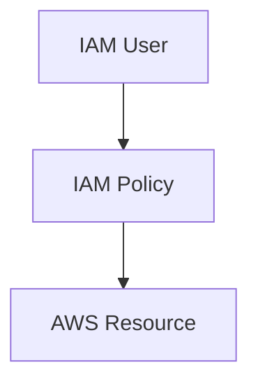

# IAM Policies

## What is an IAM Policy?

An IAM Policy is a document that defines permissions in AWS.

Policies determine:

- What actions are allowed
- What actions are denied
- Which AWS resources can be accessed

AWS uses policies to decide:

```text
Who can do what?
```

Policies are attached to IAM Users, Groups, or Roles.

---

## Why IAM Policies Exist

AWS resources must be protected from unauthorized access.

IAM Policies help organizations:

- Control access to AWS resources
- Enforce security rules
- Follow the Principle of Least Privilege

### Example

```text
Developer
│
└── Can Start EC2 Instances

Developer
│
└── Cannot Delete EC2 Instances
```

AWS determines these permissions through IAM Policies.

---

## How IAM Policies Work



### Example

```text
User: Developer

Policy:
Allow:
- Start EC2
- Stop EC2

Deny:
- Delete EC2
```

The user can only perform the actions allowed by the policy.

---

## Policy Structure

IAM Policies are written in JSON format.

### Example Policy

```json
{
  "Version": "2012-10-17",
  "Statement": [
    {
      "Effect": "Allow",
      "Action": "s3:ListBucket",
      "Resource": "*"
    }
  ]
}
```

### Important Elements

| Element   | Purpose                   |
| --------- | ------------------------- |
| Effect    | Allow or Deny             |
| Action    | AWS Operation to Perform  |
| Resource  | AWS Resource Affected     |
| Statement | Collection of Permissions |

---

## Allow vs Deny

### Allow

Permits an action.

Examples:

- View S3 Buckets
- Start EC2 Instances
- Read DynamoDB Data

### Deny

Blocks an action.

Examples:

- Delete S3 Buckets
- Terminate EC2 Instances
- Delete Databases

### Rule

```text
Explicit Deny Always Wins
```

If a policy contains both Allow and Deny for the same action, AWS applies Deny.

---

## Types of IAM Policies

### AWS Managed Policies

Created and maintained by AWS.

Examples:

- AdministratorAccess
- ReadOnlyAccess
- AmazonS3ReadOnlyAccess

### Customer Managed Policies

Created and managed by your organization.

Example:

```text
Developer Policy
```

### Inline Policies

Policies attached directly to a specific User, Group, or Role.

Used for special cases.

---

## Real-World Example

A company has:

```text
AWS Account
├── Admin
├── Developer
└── Tester
```

Permissions:

| User      | Access             |
| --------- | ------------------ |
| Admin     | Full AWS Access    |
| Developer | EC2 and RDS Access |
| Tester    | Read-Only Access   |

Each user receives only the permissions required for their role.

---

## Principle of Least Privilege

AWS recommends giving only the permissions required to perform a task.

### Good Example

```text
Developer
└── Start and Stop EC2 Instances
```

### Bad Example

```text
Developer
└── Full AWS Administrator Access
```

This reduces security risks and prevents accidental changes.

---

## Quick Summary

| Term     | Meaning                 |
| -------- | ----------------------- |
| Policy   | Set of Permissions      |
| Allow    | Grants Access           |
| Deny     | Blocks Access           |
| Action   | AWS Operation           |
| Resource | AWS Service or Resource |

### Memory Trick

```text
IAM Policy

Who?
│
├── User
├── Group
└── Role

Can Do What?
│
└── Policy
```

Policies are the foundation of access control in AWS.
