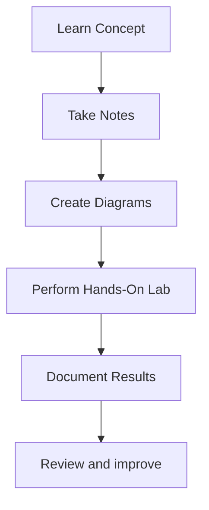

# AWS Learning Notes

<p align="center">

</p>

## About

This repository contains my personal AWS learning notes and hands on practice while exploring cloud computing concepts and AWS services.

The goal of this repository is to:

- Understand cloud computing fundamentals
- Learn AWS services through practical labs
- Document concepts with notes and diagrams
- Track learning progress over time
- Build a strong foundation in cloud technologies

## Learning Roadmap

### Completed

- [x] Cloud Computing Fundamentals
- [x] Amazon IAM (Identity and Access Management)
- [x] Amazon S3 (Simple Storage Service)
- [x] Amazon EC2 (Elastic Compute Cloud)

### Upcoming

- [] VPC
- [] Amazon RDS
- [] CloudWatch
- [] AWS Lambda
- [] Elastic Load Balancer
- [] Auto Scaling
- [] Docker on EC2

## Services Covered

| Service | Status | Notes |
|----------|----------|----------|
| Cloud Computing Fundamentals | In Progress | Notes and concepts being documented |
| AWS IAM | In Progress | Users, Groups, Roles, Policies |
| Amazon S3 | In Progress | Hands-on completed, notes in progress |
| Amazon EC2 | In Progress | Hands-on completed, notes in progress |
| Amazon VPC | Planned | Networking Fundamentals |
| Amazon RDS | Planned | Managed Relational Databases |
| CloudWatch | Planned | Monitoring and Logging |
| AWS Lambda | Planned | Serverless Computing |

## Repository Structure

```text
aws-learning-notes/
│
├── assets/
│   └── aws-logo.png
│
├── README.md
│
└── 01-cloud-computing/
    └── cloud-computing-notes.md
```

## Hands on Labs

### Amazon S3

- Bucket Creation
- Static Website Hosting
- Bucket Policies
- Public Access Configuration

### Amazon EC2

- Ubuntu Instance Launch
- AMI (Amazon Machine Image) Selection
- Instance Types
- Security Groups
- EBS Storage
- SSH Access
- Instance Termination

## Learning Approach



## Author

**Arun Sabu**

Software Engineer focused on Backend Development, Cloud Computing, and Modern Deployment Practices.
